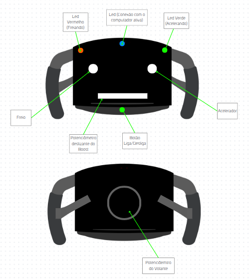
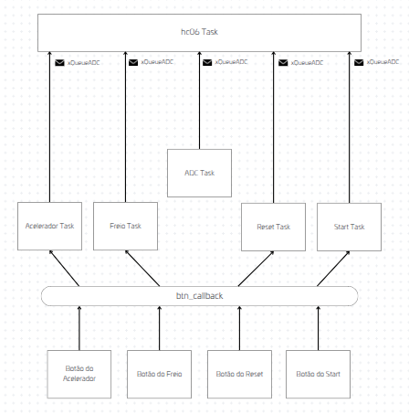

# RP2040 freertos with OLED1

basic freertos project, with code quality enabled.

---

# 🏎️ Volante de Corrida Estilo Fórmula 1

## 🎯 Descrição do Projeto

Este projeto tem como objetivo o desenvolvimento de um volante de corrida customizado, inspirado nos volantes da Fórmula 1, projetado para uso no jogo **slowroads.io**. O projeto abrange desde o design, fabricação, montagem e integração eletrônica até a configuração final do volante no jogo.

---

## 💻 Tecnologias e Ferramentas Utilizadas

| Ferramenta / Tecnologia | Uso Principal |
|-------------------------|--------------|
| **Visual Studio Code** | Desenvolvimento da interação entre o volante e o jogo |
| **Fusion 360** | Modelagem 3D do volante |
| **Impressão 3D ou Cortadora a Laser** | Fabricação das peças físicas |
| **Raspberry Pi Pico** | Comunicação entre o controle e o PC |
| **Solda e eletrônica** | Montagem dos circuitos |
| **Slow Roads** | Plataforma de teste e uso final que funciona via navegador |

---

## Materiais

O projeto foi desenvolvido utilizando os seguintes materiais:

- *4 Botões* - Utilizados para interação com o sistema, permitindo o acionamento do acelerador, do freio e do reset para a pista, além da configuração do momento de início da transmissão dos dados através do botão de start.
- *2 Potenciômetros* - Responsáveis pelo controle proporcional do volante e pelo acionamento do boost.
- *3 LEDs* - Indicadores visuais do funcionamento do sistema.
- *Chapa de MDF 3mm* - Utilizada para a estrutura e suporte dos componentes.

---

## Representação Visual do controle

---

## Diagrama do Projeto

---

🏁 **Let's race!**

